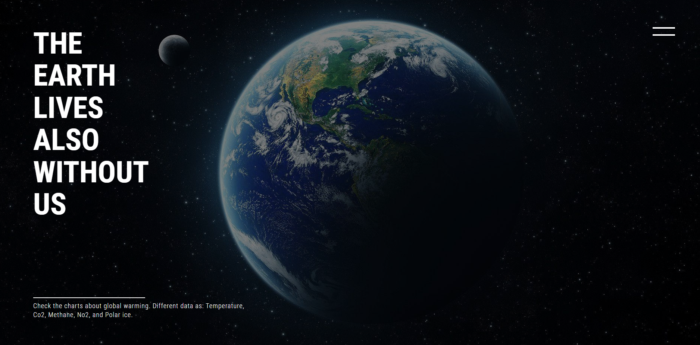
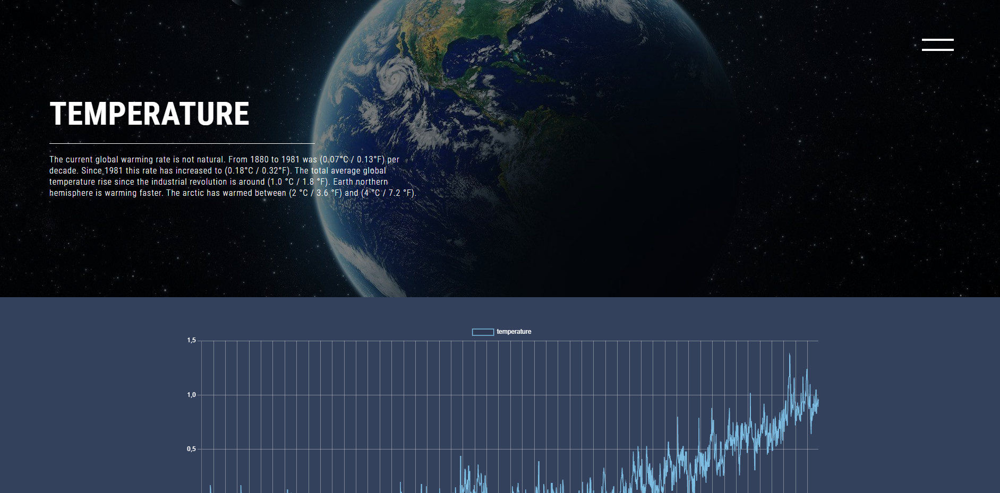

# Final Project for S2I

## Description

In this project you can check differents data about global warming.

Data:

- Temperature
- CO2
- Methane
- NO2
- Arctic extent

You can move on the differents pages using the sidebar, and look at the data on a line chart.

## What i used to create it

- HTML
- CSS
- JAVASCRIPT
- REACT
- AXIOS
- CHART.JS

## Where to try it

To try this website follow the link below!

https://final-s2i-project.netlify.app/

Thanks for your attention! 
